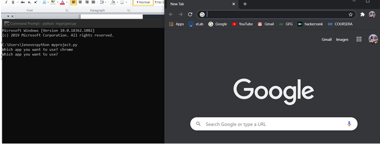

# Voice assistant

## My step by step journey to make a voice assistant. The goal is to join bit by taking one step at a time and finally create a mini bot.
 

- [x] Automation1
- [x] Automation2
- [x] Linux Menu
- [x] Text to speech (VA1)
- [x] Voice Control (VA2)

  #  👨🏻‍💻

